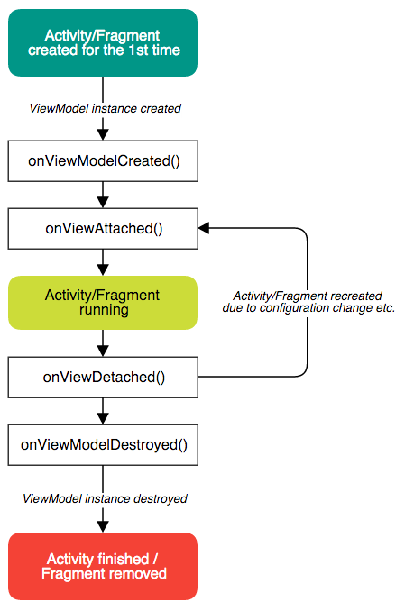

# Android ViewModelBinding 2.0
[](https://travis-ci.org/jakubkinst/Android-ViewModelBinding) [](https://android-arsenal.com/details/1/3240) [  ](https://bintray.com/jakubkinst/cz.kinst.jakub/android-viewmodelbinding/_latestVersion)
## Intro
A lightweight library aiming to speed up Android app development by leveraging the new [Android Data Binding](http://developer.android.com/tools/data-binding/guide.html) and taking the best from the [Model-View-ViewModel](https://en.wikipedia.org/wiki/Model%E2%80%93view%E2%80%93viewmodel) design pattern.

### Why should I use it?
1. **Data Binding**
 Android Data Binding is great and if you're not, you should start using it today.
2. **You don't need to care about screen rotation (configuration change) at all.**
 Most of the screen lifecycle is moved to ViewModel where the lifecycle is dramatically easier to understand and to use. The **ViewModel instance outlives it's Activity/Fragment** during configuration change so no more hassle with `onSaveInstanceState()` or using retained Fragments.
3. **ViewModel as the only variable in the layout**
 ViewModel serves as the data provider in layout's binding as well as handler for click or other methods common fro Data Binding. With a construct like `android:onClick="@{viewModel.onClickedPlayButton}"` **you will never have to set an `OnClickListener` anymore**. Also, each ViewModel extends `BaseObservable` so you have a choice between using BaseObservable approach or ObservableField approach within the DataBinding. (see [Data Binding Guide](http://developer.android.com/tools/data-binding/guide.html))

### How does it work?
The framework extensively uses Java Generics to provide a type-safe link between Activity/Fragment and ViewModel and its binding.

ViewModel instances are stored in a global static Map and reattached automatically to corresponding Activity/Fragment. When there is no need for the ViewModel anymore (Activity finished) the instance is destroyed.


### ViewModel Lifecycle


## Installation

```groovy
compile 'cz.kinst.jakub:viewmodelbinding:2.0.0'
```

Don't forget to **enable Data Binding** in your module:
```groovy 	
android {
	dataBinding.enabled = true
}
```
## Usage

### Activity/Fragment
`MainActivity.java`

```java
public class MainActivity extends ViewModelActivity<ActivityMainBinding, MainViewModel> {

	@Override
	protected void onCreate(@Nullable Bundle savedInstanceState) {
		setupViewModel(R.layout.activity_main, MainViewModel.class);
		super.onCreate(savedInstanceState);
	}
	
	// handle Activity related stuff here - Options menu, Toolbar, Window config, etc.
}
```
    
`activity_main.xml`

```xml
<layout xmlns:android="http://schemas.android.com/apk/res/android"
	xmlns:tools="http://schemas.android.com/tools" xmlns:app="http://schemas.android.com/apk/res-auto">

	<data>

		<variable
			name="viewModel"
			type="cz.kinst.jakub.sample.viewmodelbinding.MainViewModel" />
	</data>

	<LinearLayout
		android:layout_width="match_parent"
		android:layout_height="match_parent"
		android:padding="@dimen/activity_padding"
		android:orientation="vertical">

		<android.support.design.widget.TextInputLayout
			android:layout_width="match_parent"
			android:layout_height="wrap_content">

			<EditText
				android:layout_width="match_parent"
				android:layout_height="wrap_content"
				android:text="@={viewModel.name}"
				android:inputType="textPersonName|textCapWords"
				android:hint="@string/hint_enter_your_name" />
		</android.support.design.widget.TextInputLayout>


		<FrameLayout
			android:layout_width="match_parent"
			android:layout_height="0dp"
			android:layout_weight="1"
			android:animateLayoutChanges="true">

			<TextView
				android:layout_width="wrap_content"
				android:layout_height="wrap_content"
				android:layout_gravity="center"
				android:textAppearance="@style/Base.TextAppearance.AppCompat.Headline"
				android:textColor="@color/colorPrimary"
				android:text="@{@string/hello(viewModel.name)}"
				app:show="@{viewModel.name != null &amp;&amp; !viewModel.name.empty}"
				tools:text="@string/hello" />
		</FrameLayout>


		<Button
			android:layout_width="wrap_content"
			android:layout_height="wrap_content"
			android:layout_gravity="center"
			android:onClick="@{() -> viewModel.showDialog()}"
			android:text="@string/button_dialog_fragment"
			style="@style/Widget.AppCompat.Button.Colored" />
	</LinearLayout>
</layout>

```

    
### ViewModel
`MainViewModel.java`

```java
public class MainViewModel extends ViewModel {

	public final ObservableField<String> name = new ObservableField<>();

	@Override
	public void onViewModelCreated() {
		super.onViewModelCreated();
		// Do API calls etc.
	}

	@Override
	public void onViewAttached(boolean firstAttachment) {
		super.onViewAttached(firstAttachment);
		// manipulate with the view
	}
}
```

### Android Studio New Screen Template
To deploy new screens even faster, use the included [Android Studio Template](/extras/AndroidStudioTemplate) (`revision 2`)


#### Usage
1. Copy the template folder to Android Studio templates folder (`/Applications/Android Studio.app/Contents/plugins/android/lib/templates/` on Mac) OR run the following command to download and install the template automatically

		curl -o viewmodelbinding.zip -Lk https://github.com/jakubkinst/Android-ViewModelBinding/archive/master.zip && unzip viewmodelbinding.zip && cp -af Android-ViewModelBinding-master/extras/AndroidStudioTemplate/templates/. "/Applications/Android Studio.app/Contents/plugins/android/lib/templates/" && rm -r Android-ViewModelBinding-master && rm viewmodelbinding.zip
2. Restart Android Studio
3. Use `File>New>ViewModelBinding>ViewModelBinding Screen` action to add a new screen

## Changelog

#### v2.0.0 (Mar 8, 2017)
- Activity result delivered to ViewModel automatically
- ViewModel is not tied to binding (layout) anymore
- ViewModel has `getApplicationContext()` which returns Context at all times (even if View is not attached at the moment)
- Included couple of handy BindingAdapters (`app:show`, `app:hide`, `app:invisible`)
- New way of configuring Activity/Fragment (call `setupViewModel()` before `super.onCreate()`)
- Added `onViewModelInitialized()` callback to Activity/Fragment to be able to setup ViewModel before `onViewModelCreated()` is called (example: feeding ViewModel with Extras/Arguments - see `ArgumentDialogFragment` in sample)
- Optional automatic binding of Activity/Fragment into layout file next to the ViewModel instance (add variable of name `view` and appropriate type)
- [ALPHA] Added simple permission handling (PermissionManager) to ViewModel - see sample

#### v0.9.4 (Jul 18, 2016)
- ViewInterface now has to implement `startActivityForResult()`

#### v0.9.2 (Jun 28, 2016)
- Tasks added by `runOnUiThread()` are performed after `onViewAttached()` method is called when there are some left in the queue

#### v0.9 (Jun 21, 2016)
- Added safe handling of Runnables in `runOnUiThread()` - if the ViewModel is not attached to an Activity/Fragment at the time, the Runnable will be executed once it is attached again
- Added `getString()` method taking formatting arguments to ViewModel
- Added `RetrofitCallViewModel` extension for handling Retrofit calls (see the source)
- Updated dependencies (support library versions, targetSdkVersion, etc.)

#### v0.8.3 (Mar 10, 2016)
- Improved internal generics - more type-safety across the library

#### v0.8.2 (Feb 26, 2016)
- Added `isRunning()` method to ViewModel telling if Activity/Fragment is in RUNNING state (in between `onResume()` and `onPause()`)

#### v0.8.1 (Feb 3, 2016)
- Added `runOnUiThread()`, `postDelayed()` and `getRootView()` methods to ViewModel
- Added `ViewModelDialogFragment`
- `getBinding()` is now public in ViewModel

#### v0.8 (Jan 19, 2016)
- ViewModelConfig can be created without `BR.viewModel` as long as the name ov the binding variable is `viewModel`
- Added `onViewModelCreated()` callback in ViewModel
- *BREAKING* Renamed ~~`onModelRemoved()`~~ to `onViewModelDestroyed()` callback in ViewModel
- Added `getResources()` convenience method to ViewModel

## Contributors
- Jakub Kinst (jakub@kinst.cz)
- Stepan Sanda (stepan.sanda@gmail.com)
- Artem Ufimtcev (alotxo@gmail.com)

The library was inspired by a great [AndroidViewModel](https://github.com/inloop/AndroidViewModel) library by Inloop

## License
    Copyright 2015 Jakub Kinst & Stepan Sanda
    
    Licensed under the Apache License, Version 2.0 (the "License");
    you may not use this file except in compliance with the License.
    You may obtain a copy of the License at
    
      http://www.apache.org/licenses/LICENSE-2.0
    
    Unless required by applicable law or agreed to in writing, software
    distributed under the License is distributed on an "AS IS" BASIS,
    WITHOUT WARRANTIES OR CONDITIONS OF ANY KIND, either express or implied.
    See the License for the specific language governing permissions and
    limitations under the License.
